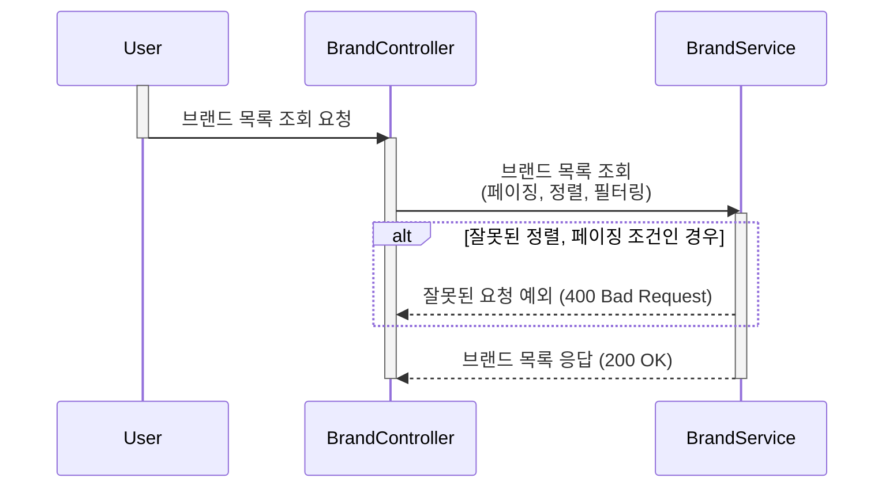
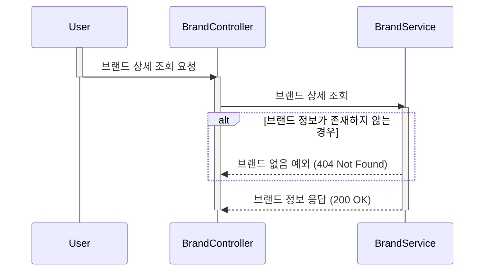
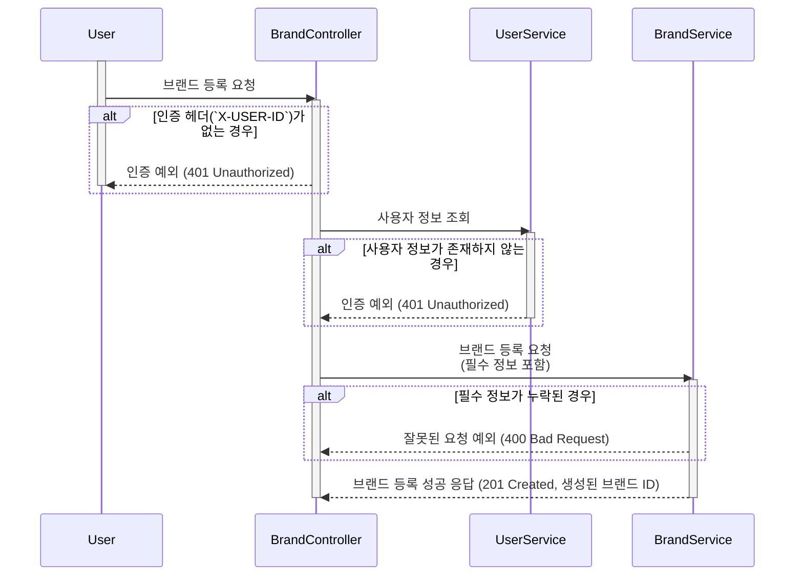

## 브랜드 시퀀스 다이어그램

### 브랜드 목록 조회

```mermaid
sequenceDiagram
    participant User
    participant BrandController
    participant BrandService
    activate User
    User ->> BrandController: 브랜드 목록 조회 요청
    deactivate User
    activate BrandController
    BrandController ->> BrandService: 브랜드 목록 조회<br/>(페이징, 정렬, 필터링)
    activate BrandService
    alt 잘못된 정렬, 페이징 조건인 경우
        BrandService -->> BrandController: 잘못된 요청 예외 (400 Bad Request)
    end
    BrandService -->> BrandController: 브랜드 목록 응답 (200 OK)
    deactivate BrandController
    deactivate BrandService
```

### 브랜드 상세 조회

```mermaid
sequenceDiagram
    participant User
    participant BrandController
    participant BrandService
    activate User
    User ->> BrandController: 브랜드 상세 조회 요청
    deactivate User
    activate BrandController
    BrandController ->> BrandService: 브랜드 상세 조회
    activate BrandService
    alt 브랜드 정보가 존재하지 않는 경우
        BrandService -->> BrandController: 브랜드 없음 예외 (404 Not Found)
    end
    BrandService -->> BrandController: 브랜드 정보 응답 (200 OK)
    deactivate BrandController
    deactivate BrandService

```

### 브랜드 등록

```mermaid
sequenceDiagram
    participant User
    participant BrandController
    participant UserService
    participant BrandService
    activate User
    User ->> BrandController: 브랜드 등록 요청
    activate BrandController
    alt 인증 헤더(`X-USER-ID`)가 없는 경우
        BrandController -->> User: 인증 예외 (401 Unauthorized)
        deactivate User
    end
    BrandController ->> UserService: 사용자 정보 조회
    activate UserService
    alt 사용자 정보가 존재하지 않는 경우
        UserService -->> BrandController: 인증 예외 (401 Unauthorized)
        deactivate UserService
    end
    BrandController ->> BrandService: 브랜드 등록 요청<br/>(필수 정보 포함)
    activate BrandService
    alt 필수 정보가 누락된 경우
        BrandService -->> BrandController: 잘못된 요청 예외 (400 Bad Request)
    end
    BrandService -->> BrandController: 브랜드 등록 성공 응답 (201 Created, 생성된 브랜드 ID)
    deactivate BrandService
    deactivate BrandController
```
