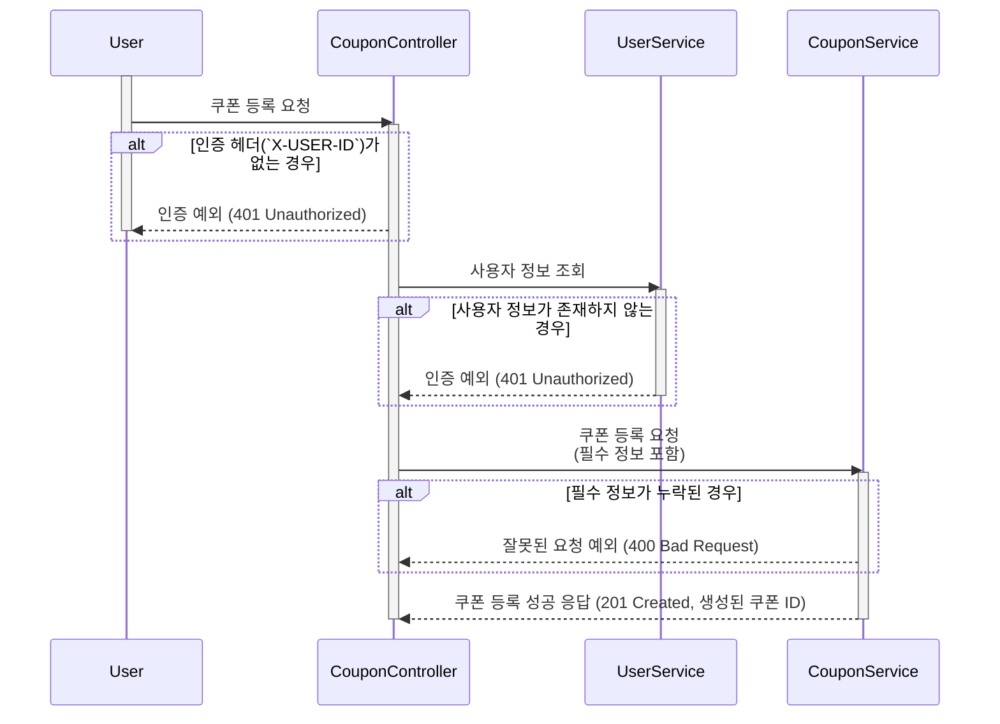
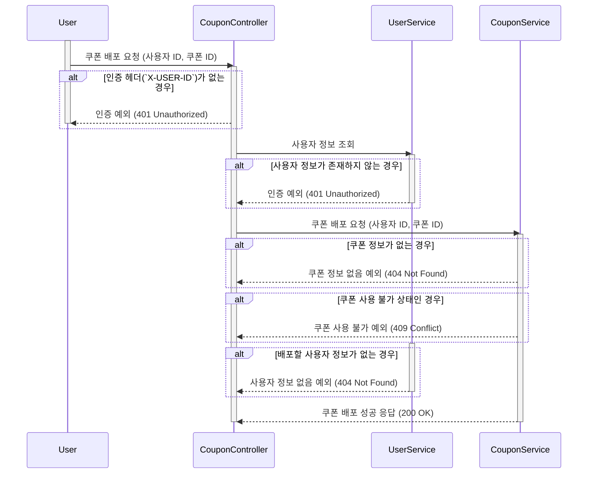

## 쿠폰 시퀀스 다이어그램

### 쿠폰 등록

```mermaid
sequenceDiagram
    participant User
    participant CouponController
    participant UserService
    participant CouponService
    activate User
    User ->> CouponController: 쿠폰 등록 요청
    activate CouponController
    alt 인증 헤더(`X-USER-ID`)가 없는 경우
        CouponController -->> User: 인증 예외 (401 Unauthorized)
        deactivate User
    end
    CouponController ->> UserService: 사용자 정보 조회
    activate UserService
    alt 사용자 정보가 존재하지 않는 경우
        UserService -->> CouponController: 인증 예외 (401 Unauthorized)
        deactivate UserService
    end
    CouponController ->> CouponService: 쿠폰 등록 요청<br/>(필수 정보 포함)
    activate CouponService
    alt 필수 정보가 누락된 경우
        CouponService -->> CouponController: 잘못된 요청 예외 (400 Bad Request)
    end
    CouponService -->> CouponController: 쿠폰 등록 성공 응답 (201 Created, 생성된 쿠폰 ID)
    deactivate CouponService
    deactivate CouponController
```

### 쿠폰 배포

```mermaid
sequenceDiagram
    participant User
    participant CouponController
    participant UserService
    participant CouponService
    activate User
    User ->> CouponController: 쿠폰 배포 요청 (사용자 ID, 쿠폰 ID)
    activate CouponController
    alt 인증 헤더(`X-USER-ID`)가 없는 경우
        CouponController -->> User: 인증 예외 (401 Unauthorized)
        deactivate User
    end
    CouponController ->> UserService: 사용자 정보 조회
    activate UserService
    alt 사용자 정보가 존재하지 않는 경우
        UserService -->> CouponController: 인증 예외 (401 Unauthorized)
        deactivate UserService
    end
    CouponController ->> CouponService: 쿠폰 배포 요청 (사용자 ID, 쿠폰 ID)
    activate CouponService
    alt 쿠폰 정보가 없는 경우
        CouponService -->> CouponController: 쿠폰 정보 없음 예외 (404 Not Found)
    end
    alt 쿠폰 사용 불가 상태인 경우
        CouponService -->> CouponController: 쿠폰 사용 불가 예외 (409 Conflict)
    end
    activate UserService
    alt 배포할 사용자 정보가 없는 경우
        UserService -->> CouponController: 사용자 정보 없음 예외 (404 Not Found)
        deactivate UserService
    end
    CouponService -->> CouponController: 쿠폰 배포 성공 응답 (200 OK)
    deactivate CouponService
    deactivate CouponController
```
