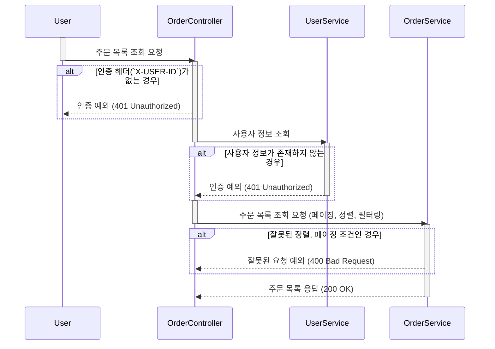
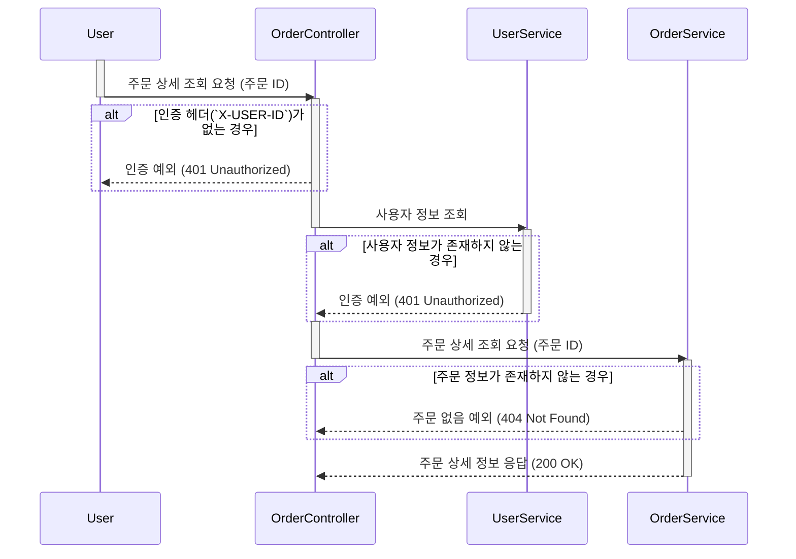

## 주문 시퀀스 다이어그램

### 주문 목록 조회

```mermaid
sequenceDiagram
    participant User
    participant OrderController
    participant UserService
    participant OrderService
    activate User
    User ->> OrderController: 주문 목록 조회 요청
    deactivate User
    activate OrderController
    alt 인증 헤더(`X-USER-ID`)가 없는 경우
        OrderController -->> User: 인증 예외 (401 Unauthorized)
    end
    OrderController ->> UserService: 사용자 정보 조회
    deactivate OrderController
    activate UserService
    alt 사용자 정보가 존재하지 않는 경우
        UserService -->> OrderController: 인증 예외 (401 Unauthorized)
        deactivate UserService
    end
    activate OrderController
    OrderController ->> OrderService: 주문 목록 조회 요청 (페이징, 정렬, 필터링)
    deactivate OrderController
    activate OrderService
    alt 잘못된 정렬, 페이징 조건인 경우
        OrderService -->> OrderController: 잘못된 요청 예외 (400 Bad Request)
    end
    OrderService -->> OrderController: 주문 목록 응답 (200 OK)
    deactivate OrderService
```

### 단일 주문 상세 조회

```mermaid
sequenceDiagram
    participant User
    participant OrderController
    participant UserService
    participant OrderService
    activate User
    User ->> OrderController: 주문 상세 조회 요청 (주문 ID)
    deactivate User
    activate OrderController
    alt 인증 헤더(`X-USER-ID`)가 없는 경우
        OrderController -->> User: 인증 예외 (401 Unauthorized)
    end
    OrderController ->> UserService: 사용자 정보 조회
    deactivate OrderController
    activate UserService
    alt 사용자 정보가 존재하지 않는 경우
        UserService -->> OrderController: 인증 예외 (401 Unauthorized)
        deactivate UserService
    end
    activate OrderController
    OrderController ->> OrderService: 주문 상세 조회 요청 (주문 ID)
    deactivate OrderController
    activate OrderService
    alt 주문 정보가 존재하지 않는 경우
        OrderService -->> OrderController: 주문 없음 예외 (404 Not Found)
    end
    OrderService -->> OrderController: 주문 상세 정보 응답 (200 OK)
    deactivate OrderService
```
