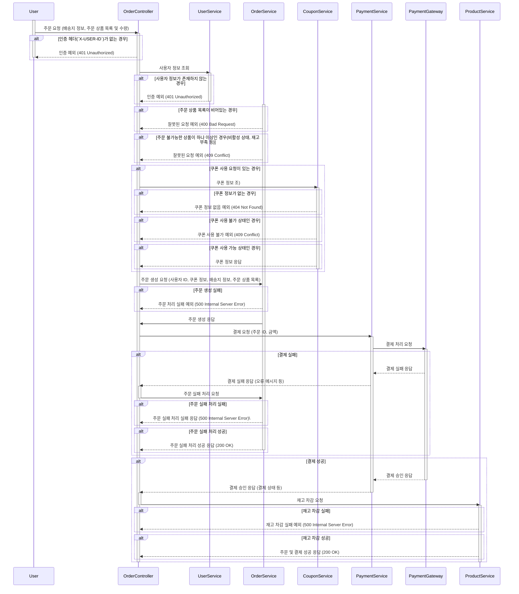

## 주문 시퀀스 다이어그램 V1

```markdown
특징:
주문과 결제는 별도의 개념이기 때문에 시퀀스 다이어그램도 별도로 작성하는 것이 좋다고 생각하지만,
학습 및 비교의 목적으로 주문 생성과 결제 처리의 흐름을 하나의 시퀀스 다이어그램으로 표현해봤습니다.

이렇게 작성하게 될 경우 주문과 결제의 흐름이 한 눈에 보이는 부분은 괜찮다고 생각하지만,
이 시퀀스 다이어그램으로 비추어 보면 주문과 결제가 하나처럼 보일 수 있기 때문에 이렇게 표현하는 방식은 혼동을 줄 수 있다고 생각합니다.
```

### 주문 생성 & 결제 처리 시퀀스 다이어그램


