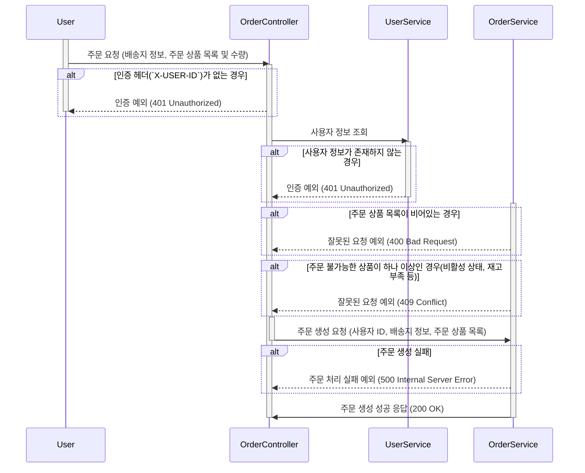
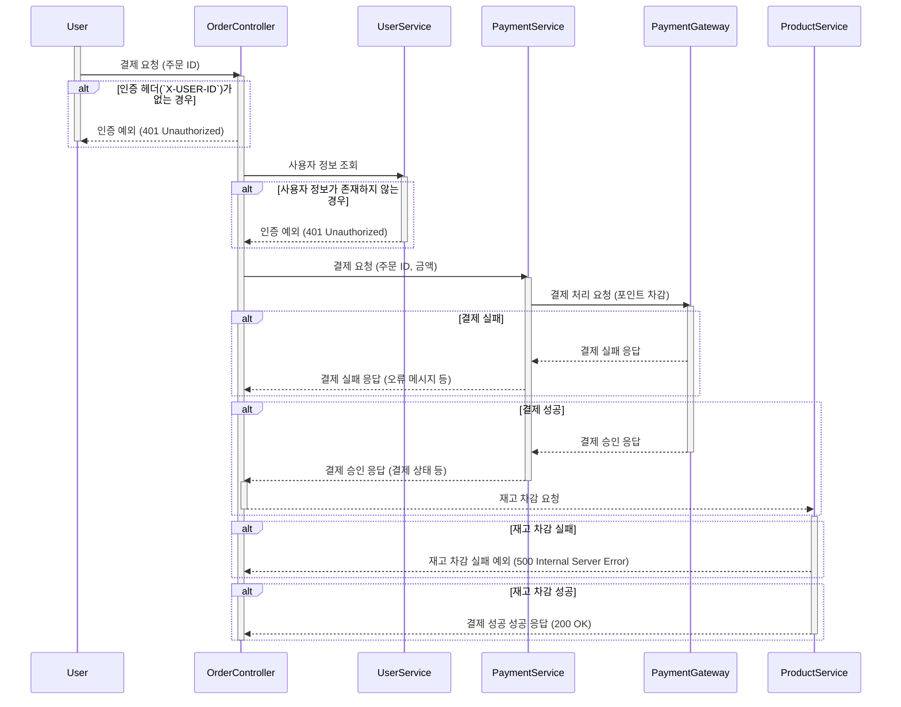
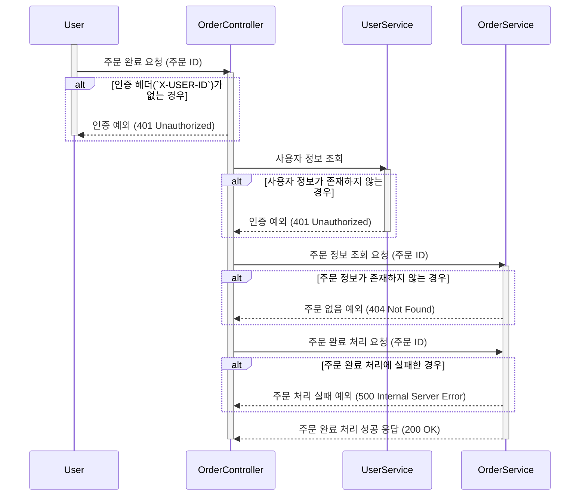
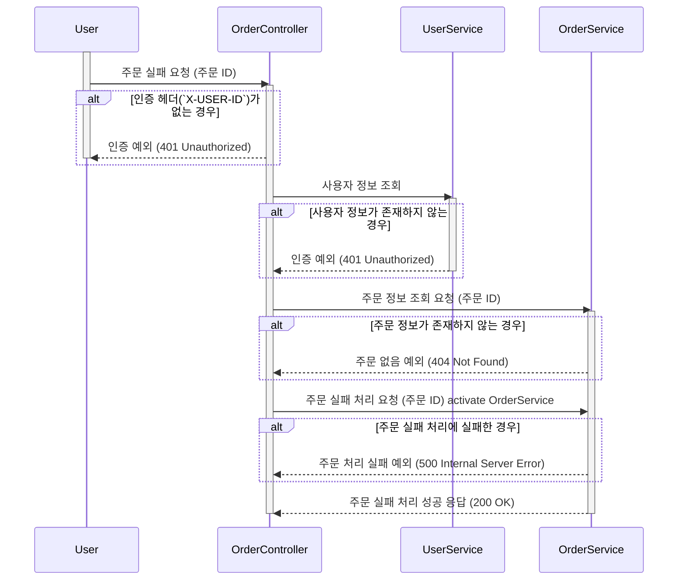

## 주문 시퀀스 다이어그램 V1

```markdown
특징:
주문 생성, 결제 처리, 주문 후처리 단계로 시퀀스 다이어그램을 분리해봤습니다.
이렇게 작성하게 될 경우 각 단계의 흐름을 명확하게 파악할 수 있어 이해하기 쉽다고 생각합니다.
```

### 주문 생성 시퀀스 다이어그램



### 결제 처리 시퀀스 다이어그램



### 주문 완료 처리 시퀀스 다이어그램



### 주문 실패 처리 시퀀스 다이어그램


