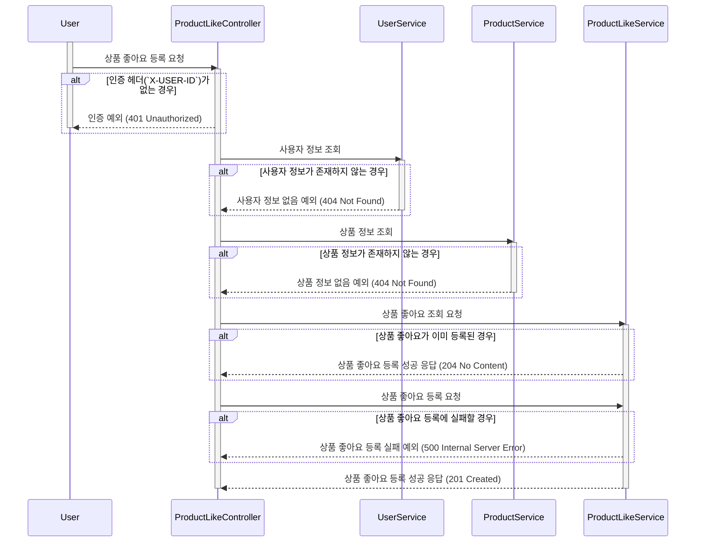
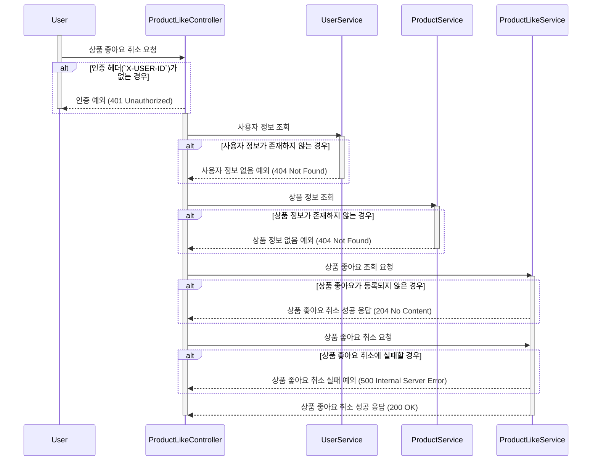
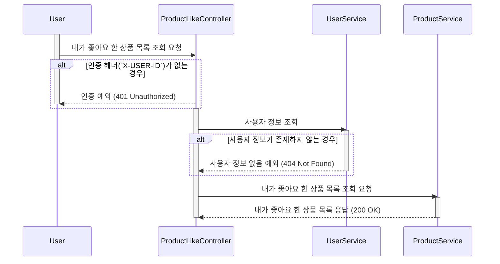

## 상품 좋아요 시퀀스 다이어그램

### 상품 좋아요 등록

```mermaid
sequenceDiagram
    participant User
    participant ProductLikeController
    participant UserService
    participant ProductService
    participant ProductLikeService
    activate User
    User ->> ProductLikeController: 상품 좋아요 등록 요청
    activate ProductLikeController
    alt 인증 헤더(`X-USER-ID`)가 없는 경우
        ProductLikeController -->> User: 인증 예외 (401 Unauthorized)
        deactivate User
    end
    ProductLikeController ->> UserService: 사용자 정보 조회
    activate UserService
    alt 사용자 정보가 존재하지 않는 경우
        UserService -->> ProductLikeController: 사용자 정보 없음 예외 (404 Not Found)
        deactivate UserService
    end
    ProductLikeController ->> ProductService: 상품 정보 조회
    activate ProductService
    alt 상품 정보가 존재하지 않는 경우
        ProductService -->> ProductLikeController: 상품 정보 없음 예외 (404 Not Found)
        deactivate ProductService
    end
    ProductLikeController ->> ProductLikeService: 상품 좋아요 조회 요청
    activate ProductLikeService
    alt 상품 좋아요가 이미 등록된 경우
        ProductLikeService -->> ProductLikeController: 상품 좋아요 등록 성공 응답 (204 No Content)
    end
    ProductLikeController ->> ProductLikeService: 상품 좋아요 등록 요청
    alt 상품 좋아요 등록에 실패할 경우
        ProductLikeService -->> ProductLikeController: 상품 좋아요 등록 실패 예외 (500 Internal Server Error)
    end
    ProductLikeService -->> ProductLikeController: 상품 좋아요 등록 성공 응답 (201 Created)
    deactivate ProductLikeService
    deactivate ProductLikeController
```

### 상품 좋아요 취소

```mermaid
sequenceDiagram
    participant User
    participant ProductLikeController
    participant UserService
    participant ProductService
    participant ProductLikeService
    activate User
    User ->> ProductLikeController: 상품 좋아요 취소 요청
    alt 인증 헤더(`X-USER-ID`)가 없는 경우
        ProductLikeController -->> User: 인증 예외 (401 Unauthorized)
        deactivate User
    end
    activate ProductLikeController
    ProductLikeController ->> UserService: 사용자 정보 조회
    activate UserService
    alt 사용자 정보가 존재하지 않는 경우
        UserService -->> ProductLikeController: 사용자 정보 없음 예외 (404 Not Found)
        deactivate UserService
    end
    ProductLikeController ->> ProductService: 상품 정보 조회
    activate ProductService
    alt 상품 정보가 존재하지 않는 경우
        ProductService -->> ProductLikeController: 상품 정보 없음 예외 (404 Not Found)
        deactivate ProductService
    end
    ProductLikeController ->> ProductLikeService: 상품 좋아요 조회 요청
    activate ProductLikeService
    alt 상품 좋아요가 등록되지 않은 경우
        ProductLikeService -->> ProductLikeController: 상품 좋아요 취소 성공 응답 (204 No Content)
    end
    ProductLikeController ->> ProductLikeService: 상품 좋아요 취소 요청
    alt 상품 좋아요 취소에 실패할 경우
        ProductLikeService -->> ProductLikeController: 상품 좋아요 취소 실패 예외 (500 Internal Server Error)
    end
    ProductLikeService -->> ProductLikeController: 상품 좋아요 취소 성공 응답 (200 OK)
    deactivate ProductLikeService
    deactivate ProductLikeController
```

### 내가 좋아요 한 상품 목록 조회

```mermaid
sequenceDiagram
    participant User
    participant ProductLikeController
    participant UserService
    participant ProductService
    activate User
    User ->> ProductLikeController: 내가 좋아요 한 상품 목록 조회 요청
    alt 인증 헤더(`X-USER-ID`)가 없는 경우
        ProductLikeController -->> User: 인증 예외 (401 Unauthorized)
        deactivate User
    end
    activate ProductLikeController
    ProductLikeController ->> UserService: 사용자 정보 조회
    activate UserService
    alt 사용자 정보가 존재하지 않는 경우
        UserService -->> ProductLikeController: 사용자 정보 없음 예외 (404 Not Found)
        deactivate UserService
    end
    ProductLikeController ->> ProductService: 내가 좋아요 한 상품 목록 조회 요청
    activate ProductService
    ProductService -->> ProductLikeController: 내가 좋아요 한 상품 목록 응답 (200 OK)
    deactivate ProductService
    deactivate ProductLikeController
```
