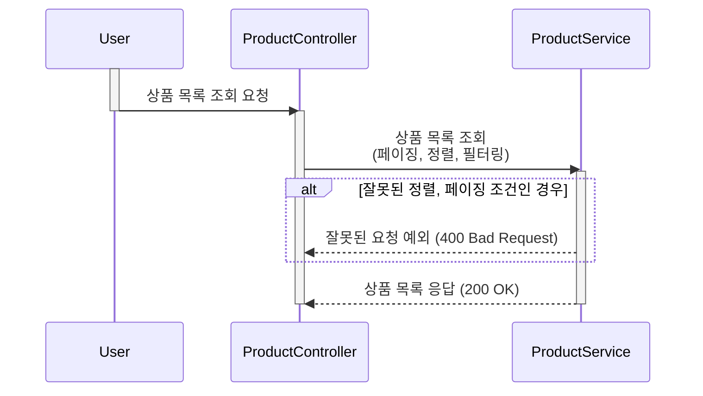
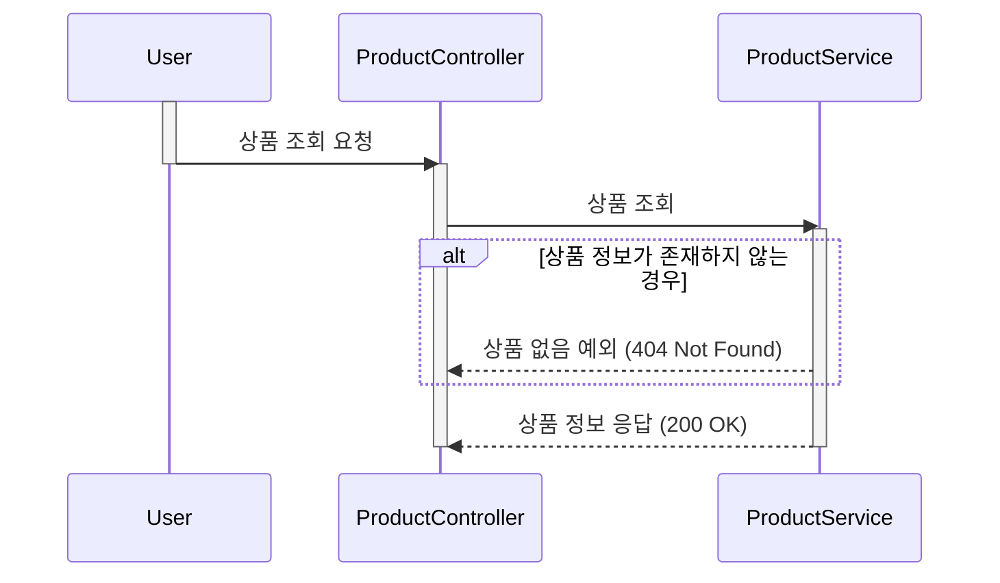
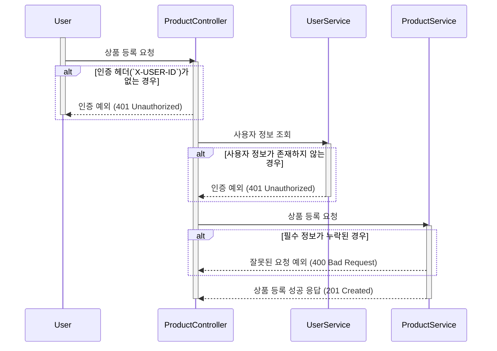

## 상품 시퀀스 다이어그램

### 상품 목록 조회

```mermaid
sequenceDiagram
    participant User
    participant ProductController
    participant ProductService
    activate User
    User ->> ProductController: 상품 목록 조회 요청
    deactivate User
    activate ProductController
    ProductController ->> ProductService: 상품 목록 조회<br/>(페이징, 정렬, 필터링)
    activate ProductService
    alt 잘못된 정렬, 페이징 조건인 경우
        ProductService -->> ProductController: 잘못된 요청 예외 (400 Bad Request)
    end
    ProductService -->> ProductController: 상품 목록 응답 (200 OK)
    deactivate ProductService
    deactivate ProductController
```

### 상품 상세 조회

```mermaid
sequenceDiagram
    participant User
    participant ProductController
    participant ProductService
    activate User
    User ->> ProductController: 상품 조회 요청
    deactivate User
    activate ProductController
    ProductController ->> ProductService: 상품 조회
    activate ProductService
    alt 상품 정보가 존재하지 않는 경우
        ProductService -->> ProductController: 상품 없음 예외 (404 Not Found)
    end
    ProductService -->> ProductController: 상품 정보 응답 (200 OK)
    deactivate ProductService
    deactivate ProductController
```

### 상품 등록

```mermaid
sequenceDiagram
    participant User
    participant ProductController
    participant UserService
    participant ProductService
    activate User
    User ->> ProductController: 상품 등록 요청
    activate ProductController
    alt 인증 헤더(`X-USER-ID`)가 없는 경우
        ProductController -->> User: 인증 예외 (401 Unauthorized)
        deactivate User
    end
    ProductController ->> UserService: 사용자 정보 조회
    activate UserService
    alt 사용자 정보가 존재하지 않는 경우
        UserService -->> ProductController: 인증 예외 (401 Unauthorized)
        deactivate UserService
    end
    ProductController ->> ProductService: 상품 등록 요청
    activate ProductService
    alt 필수 정보가 누락된 경우
        ProductService -->> ProductController: 잘못된 요청 예외 (400 Bad Request)
    end
    ProductService -->> ProductController: 상품 등록 성공 응답 (201 Created)
    deactivate ProductService
    deactivate ProductController
```
