## 클래스 다이어그램

## 브랜드-상품-상품 좋아요 클래스 다이어그램

```markdown
특징:
ProductLike 에서 사용자, 상품별로 좋아요를 관리하며, 좋아요 수는 ProductLikeCount 에서 관리합니다.
```


## 상품-주문-결제 클래스 다이어그램 V1

```markdown
특징:
**Product 단위로 주문과 결제를 처리하는 구조**로, Product 에서 price, stock 등의 속성을 관리합니다.
Order 에서 사용자, 주문자 정보, 주문 상품 목록을 관리하며, 주문 상품 목록은 OrderItem 으로 관리합니다.
OrderItem 에서 상품명, 수량, 총 가격 등을 관리합니다.
추후 쿠폰/할인 개념 도입을 고려하여 Order, OrderItem 에서 totalPrice(총 가격), amount(결제 금액) 등의 속성을 추가했습니다.
Payment 에서 결제 방법, 상태, 결제 아이템 목록, 결제 내역을 관리합니다.
PaymentItem 에서 주문 상품과 결제 금액을 관리하며,
PaymentGatewayHistory 에서 결제 내역을 관리합니다. (ex: 결제/환불)
```




```mermaid
classDiagram
%% 주문 상태 enum 정의
    class OrderStatusType {
        <<enumeration>>
        PENDING
        COMPLETED
        CANCELED
    }
%% 주문자 정보
    class OrderCustomer {
        <<valueobject>>
        -Order order
        -String name
        -Email email
        -Mobile mobile
        -Address address
    }

%% 결제 방식 enum 정의
    class PaymentMethodType {
        <<enumeration>>
        POINT
    }
%% 결제 상태 enum 정의
    class PaymentStatusType {
        <<enumeration>>
        PENDING
        COMPLETED
        FAILED
        CANCELED
    }
%% 결제 항목 상태 enum 정의
    class PaymentStatusItemType {
        <<enumeration>>
        PENDING
        COMPLETED
        FAILED
        CANCELED
    }
%% 가격
    class Price {
        <<valueobject>>
        -value: Long,
    }
%% 이메일
    class Email {
        <<valueobject>>
        -String value
    }
%% 전화번호
    class Mobile {
        <<valueobject>>
        -String value
    }
%% 주소
    class Address {
        <<valueobject>>
        -String zipCode
        -String address
        -String addressDetail
    }
%% 생년월일
    class Birthday {
        <<valueobject>>
        -String value
    }
%% 수량
    class Quantity {
        <<valueobject>>
        -int value
    }
%% 쿠폰 상태
    class CouponStatus {
        <<enumeration>>
        ACTIVE
        INACTIVE
    }
%% 쿠폰 타입
    class CouponType {
        <<enumeration>>
        AMOUNT
        PERCENTAGE
    }
%% 쿠폰 발급 상태
    class IssuedCouponStatus {
        <<enumeration>>
        ACTIVE
        USED
    }
%% 퍼센트
    class PercentRate {
        <<valueobject>>
        -Double value
    }
```

## 상품-주문-결제 클래스 다이어그램 V2

```markdown
특징:
**ProductItem 단위로 주문과 결제를 처리하는 구조**로, ProductItem 에서 price, stock 등의 속성을 관리합니다.
=> ProductItem 이 SKU(Stock Keeping Unit)이며, SKU 의 조합을 관리하는 ProductItemAttribute 를 통해 해당 상품의 속성 조합을 관리합니다.
=> ProductItemAttribute 는 ProductItem 의 속성 조합을 관리합니다. (ex: 빨강 + S 조합)
ProductAttribute 는 상품 속성 타입별 속성 값들을 관리합니다. (속성: 색상, 속성값: 빨강, 파랑 등)
ProductAttributeType 은 상품 속성 타입을 관리합니다. (ex: 색상, 사이즈 등)
ProductAttributeValue 는 상품 속성 값 타입을 관리합니다. (ex: 빨강, 파랑, S, M, L 등)
```


