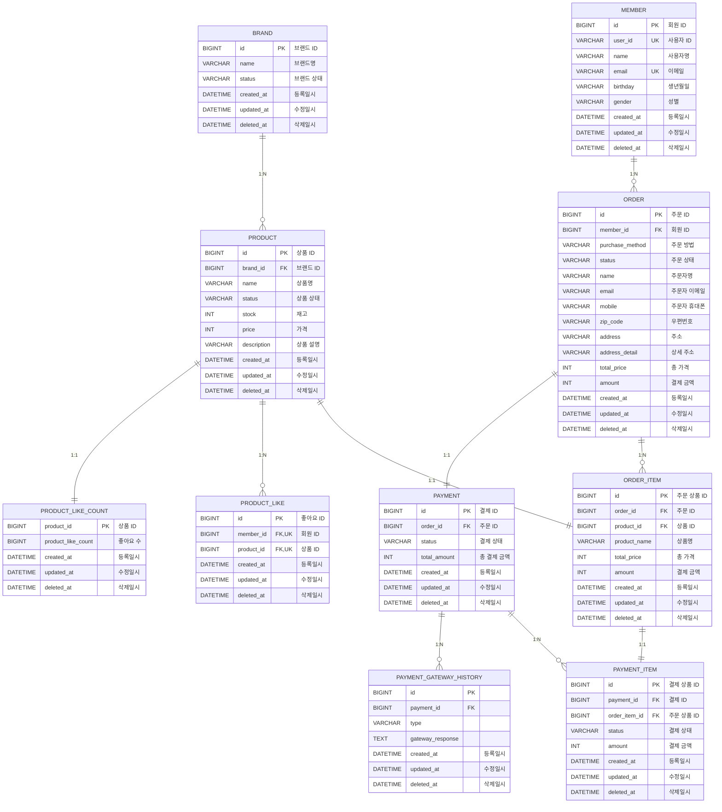

## 전체 테이블 구조 및 관계 정리

```mermaid
erDiagram
    BRAND ||--o{ PRODUCT : "1:N"
    MEMBER ||--o{ ORDER : "1:N"
    ORDER ||--o{ ORDER_ITEM : "1:N"
    PRODUCT ||--|| ORDER_ITEM : "1:1"
    PRODUCT ||--o{ PRODUCT_LIKE: "1:N"
    PRODUCT ||--|| PRODUCT_LIKE_COUNT: "1:1"
    ORDER ||--|| PAYMENT : "1:1"
    PAYMENT ||--o{ PAYMENT_ITEM : "1:N"
    PAYMENT ||--o{ PAYMENT_GATEWAY_HISTORY : "1:N"
    ORDER_ITEM ||--|| PAYMENT_ITEM : "1:1"

    BRAND {
        BIGINT id PK "브랜드 ID"
        VARCHAR name "브랜드명"
        VARCHAR status "브랜드 상태"
        DATETIME created_at "등록일시"
        DATETIME updated_at "수정일시"
        DATETIME deleted_at "삭제일시"
    }
    
    MEMBER {
        BIGINT id PK "회원 ID"
        VARCHAR user_id UK "사용자 ID"
        VARCHAR name "사용자명"
        VARCHAR email UK "이메일"
        VARCHAR birthday "생년월일"
        VARCHAR gender "성별"
        DATETIME created_at "등록일시"
        DATETIME updated_at "수정일시"
        DATETIME deleted_at "삭제일시"
    }

    PRODUCT {
        BIGINT id PK "상품 ID"
        BIGINT brand_id FK "브랜드 ID"
        VARCHAR name "상품명"
        VARCHAR status "상품 상태"
        INT stock "재고"
        INT price "가격"
        VARCHAR description "상품 설명"
        DATETIME created_at "등록일시"
        DATETIME updated_at "수정일시"
        DATETIME deleted_at "삭제일시"
    }

    ORDER {
        BIGINT id PK "주문 ID"
        BIGINT member_id FK "회원 ID"
        VARCHAR purchase_method "주문 방법"
        VARCHAR status "주문 상태"
        VARCHAR name "주문자명"
        VARCHAR email "주문자 이메일"
        VARCHAR mobile "주문자 휴대폰"
        VARCHAR zip_code "우편번호"
        VARCHAR address "주소"
        VARCHAR address_detail "상세 주소"
        INT total_price "총 가격"
        INT amount "결제 금액"
        DATETIME created_at "등록일시"
        DATETIME updated_at "수정일시"
        DATETIME deleted_at "삭제일시"
    }

    ORDER_ITEM {
        BIGINT id PK "주문 상품 ID"
        BIGINT order_id FK "주문 ID"
        BIGINT product_id FK "상품 ID"
        VARCHAR product_name "상품명"
        INT total_price "총 가격"
        INT amount "결제 금액"
        DATETIME created_at "등록일시"
        DATETIME updated_at "수정일시"
        DATETIME deleted_at "삭제일시"
    }

    PAYMENT {
        BIGINT id PK "결제 ID"
        BIGINT order_id FK "주문 ID"
        VARCHAR status "결제 상태"
        INT total_amount "총 결제 금액"
        DATETIME created_at "등록일시"
        DATETIME updated_at "수정일시"
        DATETIME deleted_at "삭제일시"
    }

    PAYMENT_ITEM {
        BIGINT id PK "결제 상품 ID"
        BIGINT payment_id FK "결제 ID"
        BIGINT order_item_id FK "주문 상품 ID"
        VARCHAR status "결제 상태"
        INT amount "결제 금액"
        DATETIME created_at "등록일시"
        DATETIME updated_at "수정일시"
        DATETIME deleted_at "삭제일시"
    }

    PRODUCT_LIKE_COUNT {
        BIGINT product_id PK "상품 ID"
        BIGINT product_like_count "좋아요 수"
        DATETIME created_at "등록일시"
        DATETIME updated_at "수정일시"
        DATETIME deleted_at "삭제일시"
    }

    PRODUCT_LIKE {
        BIGINT id PK "좋아요 ID"
        BIGINT member_id FK, UK "회원 ID"
        BIGINT product_id FK, UK "상품 ID"
        DATETIME created_at "등록일시"
        DATETIME updated_at "수정일시"
        DATETIME deleted_at "삭제일시"
    }

    PAYMENT_GATEWAY_HISTORY {
        BIGINT id PK
        BIGINT payment_id FK
        VARCHAR type
        TEXT gateway_response
        DATETIME created_at "등록일시"
        DATETIME updated_at "수정일시"
        DATETIME deleted_at "삭제일시"
    }
```
