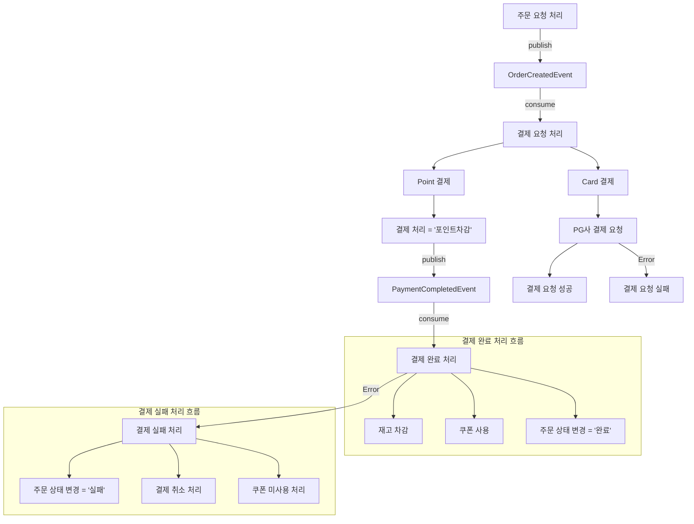

## 주문/결제 흐름

```markdown
[Event 종류]
1. OrderCreatedEvent: 주문 생성 이벤트
2. PaymentCompletedEvent: 결제 완료 이벤트
3. PaymentFailedEvent: 결제 실패 이벤트
4. OrderCompletedEvent: 주문 완료 이벤트
```


```mermaid
flowchart TD
    A[주문 요청 처리] -->|publish| B[OrderCreatedEvent]
    B -->|consume| C[결제 요청 처리]
    C --> D[Point 결제]
    C --> E[Card 결제]
    D --> F[결제 처리 = '포인트차감']
    F -->|publish| G[PaymentCompletedEvent]
    E --> H[PG사 결제 요청]
    H --> Q[결제 요청 성공]
    H -->|Error| R[결제 요청 실패]
    G -->|consume| I[결제 완료 처리]

%% === 결제 완료 처리 그룹 ===
    subgraph S1[결제 완료 처리 흐름]
        I --> J[재고 차감]
        I --> K[쿠폰 사용]
        I --> L[주문 상태 변경 = '완료']
    end

%% === 결제 실패 처리 그룹 ===
    subgraph S2[결제 실패 처리 흐름]
        I -->|Error| M[결제 실패 처리]
        M --> N[주문 상태 변경 = '실패']
        M --> O[결제 취소 처리]
        M --> P[쿠폰 미사용 처리]
    end
```
